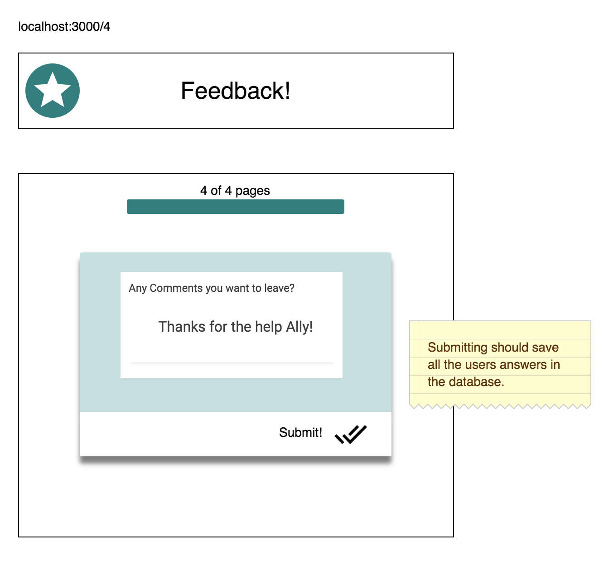

## Checklist 

- [x] Using POSTGRESQL create a database 'prime_feedback' and table 'feedback'.
- [x] Run in terminal:
```
npm install
npm install express
npm install react-router-dom
npm install redux react-redux
npm install redux-logger
```
- [x] Run in terminal w/independent tabs:
```
npm run server 
npm run client
```
- [x] Setup Provider in Index.js 
- [x] Set up initial skeleton of app
- [x] Create four seperate views with four components - Addiontally inclue final view when feedback is complete. (empty)
- [x] Create client side routing 
- [x] Create buttons to navigate between pages 
- [x] Form to collect data take in user input
- [x] Create Redux store and reducers 
- [x] Using a POST route send it via axios 
- [x] Make AXIOS get requests to pull data from db 
- [x] Append the data pulled back to the DOM 
- [] Styling the user input forms
- [x] Style the admin pages
- [x] Update READme upon completion of base functionaity.


### ADD NEW FEEDBACK

> NOTE: As a baseline requirement, you must use Redux to store your data across views.

Create a multi-part form that allows users to leave feedback for today. 
There will be 4 views for the form parts.
The parts:
- How are you feeling today?

- How well are you understanding the content?

- How well are you being supported?

- Any comments you want to leave?


While there is no nav bar, each part of the form should be at its own route. Clicking next should move the user to the appropriate step in the process.

 When the form is complete, save the submission in the database. The user should see a submission success page.
 

### DISPLAY FEEDBACK

Display all of the existing feedback at the route `/admin`. The most recently added feedback should appear at the top of the list. Allow the user to delete existing feedback. Prompt the user to confirm prior to deleting the feedback from the database.


